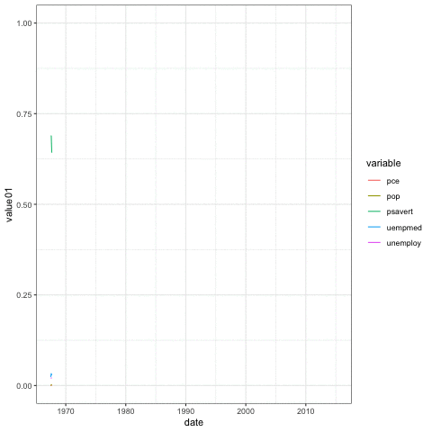

<style>
slides > slide {
  overflow-x: auto !important;
  overflow-y: auto !important;
}
</style>

```{r setup, echo=FALSE, include=F}
knitr::opts_chunk$set(fig.height = 5, fig.width =5)
options(warn = -1)
options(tibble.print_max = 5)
library(tidyverse)
library(ggpubr)
library(ggpattern)
library(sf)
library(ggspatial)
```

## the Grammar of Graphics beyond `ggplot2`
- The grammar of graphics outlined by `ggplot2` provides a uniform way to both make plots, and to write the code for making other plotting libraries. 
- Because of this, there is a wide range of other packages that additional functionality to `ggplot`, while following the same standard to allow for easy use and interoperability

## installing  external libraries

- recall that we can use `install.packges` to download packages from CRAN. However, the requirements for CRAN can be a little restrictive, and as new packages are developed, there are often long delays between uploads to CRAN. 
- almost all package developers use GitHub to host their data
- the `devtools` package provides an easy way to download such packages 

```{r}
remove.packages('RBedtools')
devtools::install_github('vinay-swamy/RBedtools', upgrade = F)
```

## the `ggpubr` library

- the `ggpubr` is built on top of ggplot, but provides a more streamlined interface to use. It was designed to be used quickly and easily for making scientific plots for users with little to know programming experience.
- this is the code to make a violin plot in ggpubr - one function call to make a single plot

```{r}
library(ggpubr)
ggviolin(ToothGrowth, x = "dose", y = "len", fill = "dose",
         palette = c("#00AFBB", "#E7B800", "#FC4E07"),
         add = "boxplot", add.params = list(fill = "white"))
```

## the `ggpubr` library

```{r}
ggviolin(ToothGrowth, x = "dose", y = "len", fill = "dose",
         palette = c("#00AFBB", "#E7B800", "#FC4E07"),
         add = "boxplot", add.params = list(fill = "white"))
```

- all the aesthetics you would need to change are specified as part of the function 

## the `ggpubr` library

- testing for statistical significance is also easy to add to the plot 

```{r}
ggviolin(ToothGrowth, x = "dose", y = "len", fill = "dose",
         palette = c("#00AFBB", "#E7B800", "#FC4E07"),
         add = "boxplot", add.params = list(fill = "white"))+  
  stat_compare_means(comparisons = list( c("0.5", "1"),  c("0.5", "2") ), 
                     label = "p.signif")+
  stat_compare_means(label.y = 50) 
```

## An aside 
- My biggest qualm with `ggpubr` is that it makes it too easy to apply a statistical analysis without really understanding what's being used. 


## the `ggpubr` library
- `ggpubr` will can also apply transformations to data for you
- For example, summarizing a range of point to there average value

```{r}
ggline(ToothGrowth, "dose", "len",
   linetype = "supp", shape = "supp",
   color = "supp", palette = c("#00AFBB", "#E7B800"), add='mean')
```

## the `ggpubr` library
- customizing plots is a lot easier as well

```{r}
ggline(ToothGrowth, "dose", "len",
   linetype = "supp", shape = "supp",
   color = "supp", palette = c("#00AFBB", "#E7B800"), add='mean_se')
```

- While `ggpubr` excels for making quick and descriptive plots, it lacks a lot of flexibility. Use it when when you need something out of the box, but if you need something a little more complicated, stick with ggplot

## adding patterns to plots 

- Using patterns has a long history in scientific plots.
- patterns provide another "dimension" to showcase a categorical variable
- patterns are available through the `ggpattern` package

```{r}
library(ggpattern)
df <- data.frame(level = c("a", "b", "c", 'd'), outcome = c(2.3, 1.9, 3.2, 1))

ggplot(df) +
  geom_col_pattern(
    aes(level, outcome, pattern_fill = level), 
    pattern = 'stripe',
    fill    = 'white',
    colour  = 'black'
  ) +
  theme_bw(18) +
  theme(legend.position = 'none') + 
  labs(
    title    = "ggpattern::geom_pattern_col()",
    subtitle = "pattern = 'stripe'"
  ) +
  coord_fixed(ratio = 1/2)
```

## adding patterns to plots 

- with a little bit more code, multiple patterns can be added 

```{r}
iris_dfac <-  iris %>% 
  mutate(dfac = sample(c('long', 'short'),size = nrow(.), replace = T)) %>% 
  group_by(Species, dfac) %>% 
    summarise(dcol = n())
ggplot(iris_dfac)+ 
    geom_col_pattern(aes(x=Species, y=dcol, pattern_density = dfac, fill = Species),
                     pattern_color = 'white',
                     color='black',
                     position = 'dodge', pattern_fill = 'white', 
                     pattern= 'crosshatch')  + 
    theme_classic()
    
    

```

## lets do some examples 

## external themes

- While the base ggplot themes are nice, there are *many* published themes and palettes that you can use with your plots
- We'll cover two packages,`ggthemes` and `ggsci`

```{r}
library(ggplot2)
library(ggthemes)
ggplot(iris) + 
  geom_boxplot(aes(x= Species, y= Sepal.Length, fill = Species)) + 
  theme_minimal()


```

## external themes
- a theme mimicking the Wall Street Journal

```{r}
ggplot(iris) + 
  geom_boxplot(aes(x= Species, y= Sepal.Length, fill = Species)) + 
  ggthemes::theme_wsj()
```

## `ggsci`

- many journals and magazines have specific color palettes they use for their publications. the `ggsci` provides close approximation for several of these 

```{r}
library("ggsci")
data(diamonds)
diamonds <- diamonds %>% mutate(cut = as.character(cut))
p1 = ggplot(subset(diamonds, carat >= 2.2),
       aes(x = table, y = price, colour = cut)) +
  geom_point(alpha = 0.7) +
  geom_smooth(method = "loess", alpha = 0.05, size = 1, span = 1) +
  theme_bw()
p1
```

## `ggsci`
- This is a theme popular in *Nature* publications 

```{r}
p1 + scale_color_npg()  

```

## `ggsci`
- This is a theme popular in *Science* publications 
```{r}
p1 + scale_color_aaas()
```
- and there are many more 


## animated plots 
- animated plots are all the rage these days, and thanks to the `gganimate` package, making animated plots is super easy

```{r}

```

## animated plots
- `gganimate` works by having `transition_...` functions that can change the color or positions of geoms based on  time or another continuous variable

- the code to make the animated plot

```{r, eval=F}
library(gganimate)
data("economics_long")
ani_plot <- ggplot(economics_long)  +
  geom_line(aes(x=date, y=value01, color = variable)) + 
  theme_bw()+
  transition_reveal(date)
#anim_save('../src/economic_lg_ani.gif', ani_plot)
```

## lets do some examples 

## Plotting Maps in R
- R was well known in its early years for having good libraries for making plots with maps.
- While not too common in biological sciences, map based plots are common in fields like public health and ecology
- The libraries for making maps are notoriously difficult to install, especially on a Mac. We'll go through how to install its later, but it will probably be easier if you use the `binder` link in the repo

## the `sf` package
- `sf` stands for "simple features", and is a way for representing the physical diagram of a map as a dataframe. This format is not unique to R, and is used by many different programs 
- `sf` is the successor to the `sp` package, which was what gave maps in R its fame 

## the `sf` package
- This is some example data provided in the `sf` package. It contains geospatial information about the state of North Carolina. you can recognize geospatial data by the `.shp` extension. the `st_read` function allows you to read `.shp` data into R. Within R, it exists as a custom class, also called `sf
```{r}
library(sf)
nc <- st_read(system.file("shape/nc.shp", package="sf"))
nc
class(nc)
```

## the `sf` package
- the most important part of an `sf` object is the `geometry` column; this contains the actual information about how to draw each map

- `sf` objects can be easily coerced to a tibble

```{r}
nc_table <- nc %>% as_tibble
nc_table
```

## the `sf` package
-`sf` was designed to be used with base R's plotting interface

```{r, message=F, warning=FALSE}
plot(nc)
```

## the `sf` package
- but since plotting in base R isn't great, we'll be combining `sf` with another package, `ggspatial`. 
- when using `geom_sf`, we can directly pass `sf` objects. When doing this, aesthetic mappings are automatically generated

## the `ggspatial` package
```{r}
library(ggspatial)
ggplot(data = nc ) +
    geom_sf() + 
    theme_bw()

```

## the  `ggspatial` package
- when using using a `tibble` as input, manually specify the aesthetic mapping

```{r}
ggplot(nc_table) + 
    geom_sf(aes( geometry= geometry)) + 
    theme_bw()
```

## the `ggspatial` package
- from here, we can treat the plot like a normal `ggplot`, changing aesthetics as we please

```{r}
ggplot(nc_table) + 
    geom_sf(aes( geometry= geometry, fill = SID74)) + 
    theme_bw()
```

## Using Maps with real data 
- Almost always, real data does not come with geometry coordinates attached. if you're lucky, you'll get tabular data that has some kind of easy geographical identifier, like state, country, or zip code.
- Here's an (slightly morbid) example - Violent Crime Arrests in the US
```{r}
data("USArrests")
USArrests
```

## the `sf` package
- the general workflow for plotting maps is taking an `sf` object that has defined geometry, and then connecting the `sf` data to our tabular data.

- there are multiple packages for obtaining map data, but its often not in `sf` format. luckily, the `sf` package provides the function `st_as_sf` to convert other formats to `sf` format

## the `sf` package
```{r}
library(maps)
library(sf)

states <- maps::map("state", plot = FALSE, fill = TRUE) %>% st_as_sf() %>% 
    as_tibble %>% 
    rename(state = ID, 
           geometry = geom)


states
```

## the `sf` package
```{r}
arrests <- USArrests %>% rownames_to_column('state')
arrests
```

## the `sf` package
```{r}
inner_join(arrests, states)
```

- What happened?


## always check your joins!
- in this case the cases in the `state` column doesn't match 

```{r}
states <- states %>% 
    mutate(state = tolower(state))

arrestData_with_mapData <- arrests %>%
    mutate(state = tolower(state)) %>% 
    inner_join( states)
ggplot(arrestData_with_mapData) + 
    geom_sf(aes(geometry = geometry, fill = Assault)) + 
    theme_bw()


```

## cleaned up map

- lets pretty it up a little
```{r}

ggplot(arrestData_with_mapData) + 
    geom_sf(aes(geometry = geometry, fill = Assault)) + 
    scale_fill_viridis_c('Hundreds of Persons') + 
    ggtitle('Number of Assaults per state')+
    theme_void()

```
 
## using coordinate systems 

- sometimes you don't even get a region, and just get latitudes, and longitudes

- this is some example data about the locations of earthquakes in Fiji 
```{r}
data("quakes")
quakes %>% head
```

## using coordinate systems 

```{r}
library(rnaturalearth)
library(rnaturalearthdata)
world <- ne_countries(scale = "medium", returnclass = "sf")

quakes_sf <- quakes %>% st_as_sf(coords = c("long", "lat"),crs = 3460 ) %>% as_tibble 
ggplot() +
    geom_sf(data = quakes_sf,  aes(geometry = geometry), alpha = .1)+
    geom_sf(data = world, color = 'red') +
    coord_sf( ylim = c(-50, -10),  xlim = c(165, 200)) + 
    theme_bw()

```


## lets do some practice 
