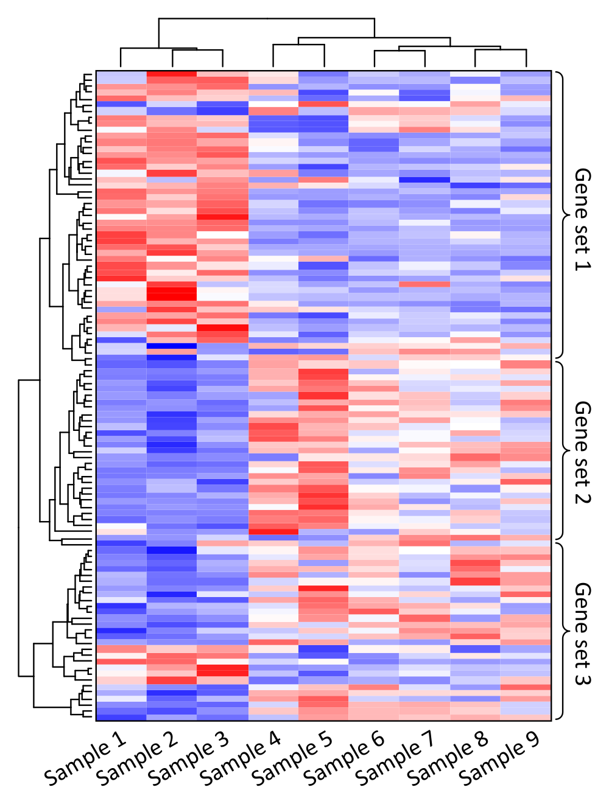

<style>
slides > slide {
  overflow-x: auto !important;
  overflow-y: auto !important;
}
</style>

```{r setup, echo=FALSE}
knitr::opts_chunk$set(fig.height = 5, fig.width =5)
options(warn = -1)
library(knitr)
```

## Learning how to use a new plotting package(or any package)

- We've spent a good chunk of time going learning some libraries, but now I want show you how to learn to use a new package.
- This is an *very* useful skill, but one that's not formally taught very often.
- Generally, people want to use a new package because they have some sort specific task/problem that can be solved by that package.

## Heatmaps 

- As a case study for learning a new package, we're going to go learn how to plot heat maps, which are difficult to produce with `ggplot`
-  Heatmaps are a common type of plot for clustering data.
```{r, echo = F}

```

## Heatmaps 

- Heatmaps are used to show subpopulations within a set of data, both between observations and between variables. This happens by clustering both the row vectors, and the column vectors. 
- Heatmaps are extremely popular(if not seriously overused) in papers at the moment , because beyond being an informative figure, they can be aesthetically cool to look at.

## `ComplexHeatmap`

- `ComplexHeatmap` is package for, you guessed it, making heatmaps, and is probably the most popular package for doing so. 
- its popularity comes from having a feature rich and well documented API
```{r echo =F}
include_graphics('../src/complex_heatmap_example.png')
```


## Application Programming Interfaces( APIs)

- broadly an API is format and design of functions within a specific package.
- `ggplot` is an example of a well structured API - where we have functions that are separated into separate categories, like `geom` and `theme` etc, and within each categories functions have generally the same syntax. 
- Taking some time to read through a package's API and understand how it works can save you a LOT of time down the road. 

## Learning an API
- Work through the examples a package provides - and then start changing things to see what happens. 
- Don't just copy and paste code, try and understand why its written the way it is.
- Some times documentations use a lot of jargon. If you are confused look things up as you read, and if it really doesn't make sense just skip it and see if you really need to understand what it means.


## `ComplexHeatmap` API
- the documentation for `ComplexHeatmap is at https://jokergoo.github.io/ComplexHeatmap-reference/book/ and its quite extensive
- It's completely different from `ggplot`, so don't assume what we have learned previously will transfer. 
## `ComplexHeatmap` exercises
- We're going to do some exercises with this package. However instead me explaining how everything works before, you will first read through different parts of the documentation, then try and complete the exercises. 


