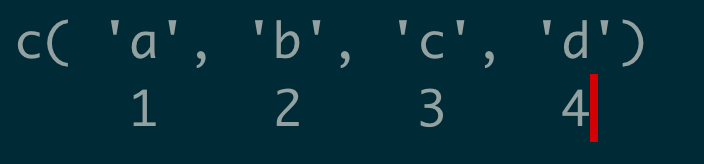

<style>
slides > slide {
  overflow-x: auto !important;
  overflow-y: auto !important;
}
</style>


## Course Goals

- Learn basic programming concepts using the R programming language
- Learn how to use data manipulation libraries to prepare data for plotting
- Learn how to use plotting libraries to make visualizations

## Course Overview 
 
- Day 1: Introduction to R; Learning to make basic plots with `ggplot2`
- Day 2: Manipulating data in R; Creating complex plots with `ggplot2`
- Day 3: Created Figures, reports, and posters; Useful Plots to Know
- Day 4: Making Interactive webapps with Shiny
- Day 5: Final Project and Project presentations  

## Lecture Format

- We'll move between lecture and exercises fairly often(10-20min lecture, 10-20 min exercises)
- Slides are available on the course repo, and in canvas
- exercises are also in the github repo. 


## How to best take advantage of this course

- The more you participate, the more you'll get out of it - ask questions, and answer the questions I ask you.
- Make sure you understand material to the best of your ability as we are covering it. Much of what we learn early on in the course is vital to material later in the course. 
- Its best to ask questions out loud, but I'll do my best to monitor the chat as well.

## Workshop Final Project

- Ideally, you'll use what you learn in the course to help you with your own work, like
  - creating and assembling multiple plots into a figure for paper, 
  - creating a poster for your next conference, 
  - building an interactive webapp to explore data with
  
## What is R and why is it good for making visualizations

- R is a **programming language** designed for statistics, used heavily in multiple fields of research.
- Researchers who needed to use statistics turned to R because it is free and open source.
- Researchers need to make plots and figures to put in publications, so they began developing plotting packages for R
- As biology is growing more and more computational, more biologists are using R for analysis and visualization

## Example Visualization 
<div class="columns-2">
```{r, echo=FALSE}
knitr::include_graphics('../src/fetal_retina_diff_exp-1.png', dpi=1000)
```

- this is an example of a figure made entirely in R. 
- (hopefully) At the end of this course you'll be able to make something like this
</div>
 
## R is useful for making interactive visualizations
- R also excels at making fast, interactive webapps, like this [covid-19 tracker](https://vac-lshtm.shinyapps.io/ncov_tracker/?_ga=2.255768001.835685898.1601257185-1821184268.1598473205)


# A Brief Overview on Programming and Computers

## What is programming
- In a nutshell, it's providing a set of instructions to a computer to perform a specific task
- Computers can do these tasks extremely fast, allowing us to accomplish a lot more than manually performing a task, ie using a calculator vs doing math by hand

## How will we be using programming?

- In this course, we will be writing code to manipulate data/information. 
- Data can be anything - a file stored on your hard drive, or numbers as you enter them into a calculator
- This is, in general, is the most common application of programming

## Manipulating data within the context of creating visualization

- In order to go from raw data( spreadsheet, text file, etc) to a picture generally requires two things:
1. A method specifying the layout and aesthetics for a visualization. For reasons I will explain later, raw data will need to be formatted an re-arranged into a specific format that can be used for visualization
2. Converting raw data into the aforementioned format suitable for plotting.

## How do computers represent data
- Computers have two primary ways for storing data: *disk* and *memory*
- Disk: The disk is your hard drive. By design, disk's *can* store a lot of information, but accessing and manipulating it is slow
- Memory: (also known as RAM) Basically the exact opposite of disk - *cannot* store a lot of, but what is stored can be accessed and manipulated quickly
- Storing and manipulating information in memory is one of the core functions of any programming language. R, in particular, is a memory hungry language

## Plain text files
- Most code is written and stored in plain text files, for files that have nothing in them except text
- These do not include Microsoft office file formats 
- common text file formats - .txt, .tsv, .csv etc
- you can check if a file is plain text by trying to open it with notepad or textedit

## Programming fundamentals - Syntax
- As mentioned early, programming creates set of instructions that control a computer. Computers only "understand" machine code, such as binary - 1's and 0's. For example, the letter `A` in binary is`01000001`. 
- It would be a real pain to write in pure binary( no one does this), and so we use programming languages which are much more readable by humans. 
- For any given programming language, there is a core program that converts instructions written in the programming language to machine code. For R, the program that understands converts R code is called the R interpreter.


## Programming languages vs Written and spoken languages
- The two are similar in that they both have a defined grammar and syntax that govern how they are written. 
- However, programming languages are **MUCH** more strict than spoken languages. 
- Syntax is extremely important - if we don't format our commands correctly, the interpreter won't understand how to run the commands properly. 
- Interpreters are unforgiving - a single mistake will cause your code to fail. 
- 99/100 times if you get an error while coding, it will be a syntax error
- As you see code in the slides below, pay close attention to the way it is formatted. 

## What you should and should not memorize
- There's no quick and easy trick to learn syntax - its something you'll have to memorize. 
- However, always try to understand conceptually whats going on around the syntax


## Variable 
- Variables are core programming principle
- We use variables to store data so we have easy access to it 
```{r}
my_variable=5
my_variable
```
- note the syntax

## Variable
- Formally, a variable is named location in memory. (Memory in this instance refers to RAM, not storage/disk)
- Any variable you declare will only exist within the R session its declared in. Once we close an R session, all variables were using will be deleted, and memory will be returned to the system.

## Variable 

- in R there are two ways to assign data to variable, with `=` as above, or `<-`. They mean slightly different things, but are essentially the same. Most people us the `<-`. The keyboard shortcut for `<-` is `alt/option` + `-`
```{r}
my_variable <- 5
my_variable
```

## variable names
- the name of a variable must be a continuous string of letters and numbers, and must start with a letter, and can contain the any of these symbols `. - _`. NO SPACES
- `my_var <- 5` good
- `my var <- 5` bad
- `1var <- 5` bad
- creating a variable is often called "declaring" 
- once a variable is declared, it will keep that value and exist until the R session is ended

## choosing a variable name
- make an effort to use descriptive variable names. (this is a *very* good habit to build)
- `var1 = 0.01` bad
- `minimum_pvalue = 0.01 ` good. 

## Lets Practice
- open Rstudio on your computer

## Rstudio 

- Rstudio is a integrated development environment for R
- We'll be using Rstudio for writing and running our code
- The advantage of using Rstudio,is that it offers useful tools like plot viewers, variable explorers, keyboard shortcuts and more

## Types of Variables

- In R, there are 4 major types of variables: Numeric, character, factor, and Logical, but we'll cover the first two for now
 - numeric: any number: `x <- 1`,  `x <- .5`
 - character: any letters or characters `x <- "H"`, `x <- 'H'`, `x<- 'Hello'`. 
 - All characters must be enclosed by either `'` or `"`, but has to be the same for each side; 
 - I'll often refer to `character`s as "strings"  
```
x <- 'hello' #good
x <- hello  #bad

```

## Why are there different kinds of variables
- Computers can only store numerical values in memory. This is easy for numerical data, but for lexicographic data, a mapping between letters and numbers must be created. 
- `Numeric` and `logical` data types require the least amount of memory, followed by `factor`, and `character` at the end.


## Vectors
- A vector is a type of variable that stores multiple values. 
```{r}
Vector <- c(1,2,3)
```
- Each individual item in a vector is called an Element. Note the syntax for defining a vector
- one of the quirks about R is that every base type is a vector, but we'll talk more about this later

## Vectors

- Vectors can be joined, or concatenated similar to how they are created

```{r}
l1 <- c(1, 2, 3)
l2 <- c(-1,-2,-3)

joined <- c(l1, l2 )
```

## Indexing 

- Often times, we will want to access specific elements within a list. We can do this with indexing 
- an Index is an element's specific position within a list

## Indexing 
- each element in a vector can be indexed by its numerical position relative to the start of the list 

```{r,echo=FALSE, fig.height=1, fig.width=2}

```

- So to access the second element of this list, I would use the following

```{r}
vec <- c('a', 'b', 'c', 'd')
vec[2]
```

## Indexing 
- We can use a vector's index to select multiple locations at once . 

```{r}
locs <- c(2, 4)
vec[locs]

```

## Indexing 

-  to select a continuous range of values, we can use the `:` operator. This is called *slicing*

```{r}
vec[1:3]
```

- Note that the start *and* stop of the range are included when using this notation. This and starting array indexing at 1 are a couple quirks in R that separate it from other programming languages

## updating values in a vector 

- We can use indexing to change the values in a vector, by first indexing a location, and then setting its value. This is called "modifying in-place"

```{r}
vec[1] <- 'Z'
vec
```
- This permanently changes the vector, so be careful about changing vectors like this


## Time for some Exercises

## Type coercion

- In many languages, its against the rules to have elements of different types in the same vector, IE having a `numeric` and a `character` in the same vector
- In R, its not technically against the rules, but when you declare a vector with 2 types, it will force one element to converted to the type with the highest priority. For the two data types we have covered, character > numeric

## Math in R

- As R was designed for statistics, you can do a lot of math. All the normal math rules apply 
```{r}
2+2
```
```{r}
5-2
```
```{r}
((8*4) + 3)/5
```

## Math in R 
- mathematical operations can be directly applied to vectors. All operations are done element wise 
```{r}
c(1, 2, 3) + 5
```
- for operations with 2 vectors, vectors must be of the same length, or longer vector length must be a multiple of shorter vector length
```{r}
c(1, 2, 3) * c(1, 2, 3)
```

## Math in R 
```{r, error=T}
c(1, 2, 3) * c(1, 2, 3, 4)
```


```{r }
c(0, 2) * c(1, 2, 3, 4)
```

- characters cannot be added together

```{r error=TRUE}
'h'+'i'
```

## Functions 

- functions are pieces of code that perform actions. There are many functions that are available within base R. For example consider the `sum` function, which sums all elements in a numeric vector. Note the syntax
```{r}
vec <- c(1, 2, 3, 4, 5)
sum(vec)
```
- broadly, functions take an input, do something, and return a new output
- using a function is often referred to as "calling". we call functions by passing arguments inside the parenthesis. In this case, we passed the `vec` variable to the `sum` function. 
- A function can multiple arguments, or none. 

## passing arguments to functions
- Every argument in a function has a name. We can  consider this name a variable that is defined *inside* the function. We can see these with the `args` function.

```{r}
args(mean)
```
- the arguments you pass to a function can be directly named within the function
```{r}
mean(x=vec)
```

## passing arguments to functions
- Some functions take a variable number of arguments. if it does,  you'll see `...` as one of the function argument
```{r}
args(sum)
```
- the order in which you write the arguments matters; when you don't provide the names for arguments,they are assigned to arguments in the order that th arguments are written in the function.  
- This is  why its generally better to always explicitly assign arguments to their respective names


## useful functions in base R
- `sum`
- `mean`
- `paste`
- `length`
- `print`
- `as.numeric`
- `as.character`

## Time for some exercises

## Defining a function
- sometime there won't be a predefined function for the task you want to complete, and you'll have to write your own 
- here is an example for adding two numbers together. Note the syntax - assigning a name to the function (`add`), defining arguments for the function( `num_1` & `num_2`), and then writing the actual code for the function within the brackets. 
- Once we have generated the final value we want for our function, we can pass it back to the main environment using the `return` function

```{r}
add <- function(num_1, num_2){
    result <- num_1 + num_2
    return(result)
}

add(1,1)
```

## Defining a function
though you don't always need to use the `return` function, is best practice to do so. If you want to return nothing, you can call `return` with no arguments

```{r}
add <- function(num_1, num_2){
    result <- num_1 + num_2
    print('this is the sum')
    print(result)
    return()
}
add(1,1)
```

NULL, which is essentially an empty value, is returned by calling `return` with no arguments.

## more exercises

## Other Data Structures

- A data structure is fancy container to hold data. We have been using one - the vector
- while vectors are useful for storing individual values, they have some drawback
- vectors cannot be nested, meaning you can't have a vector of vectors
- for example, say you have q-PCR measurements from an experiment - want to store a vector of measurements, as well as the condition for each experiment, and you would like to store that information as a variable in R 
- Solution -use a list

## lists 
- lists are fancy vectors - but can store multiple datatypes and data structures 
- lists are declared using the `list` function. For example

```{r}
simple_list <- list(1, 'a')
print(simple_list)
```

## lists  
- a list with both a character and a vector
```{r}
list_with_vector <- list('condition A', c(1, 23, 4, 56, 7, 66))
print(list_with_vector)
```

## indexing with lists 
- indexing with lists is slightly different than vectors. when using `[]`,  a smaller list is returned, depending how many indices you requested. We can check this with the `class` function, which allows you to see a variables data type

```{r}
list_with_vector[1]
```
```{r}
class(list_with_vector[1])
```

## indexing with lists  
- to access the element stored in a specific index, use double brackets `[[]]`

```{r}
list_with_vector[[1]]
```

```{r}
str(list_with_vector[[1]])
```

## nested lists
- lists can contain other lists. this can get a little confusing

```{r}
big_list <- list(simple_list, list_with_vector)
big_list
```

## Names

- we can assign labels to indices for lists and vectors, in order to make it easier to access data
- consider the above example about measurements on X. instead of storing a separate entry for the condition, we can set the name of the vector within the list, and access that element by its name, similar to indexing 

```{r}
experiment <- list(condition_a = c(1,2,3,4,5,5,6), 
                   condition_b = c(0,0,0,0,2,3,0))

experiment[['condition_a']]
```

## Names

- vectors can also be given name
```{r}
named_vector <- c('first'=1,'second'=3, 'third'=5 )
named_vector['third']
```

- Note that named lists/vectors still retain their numerical index

```{r}
named_vector[3]
```

## setting names 

- the `names` function allows you to set the names of a list or vector *after* its declared

```{r}
experiment <- list(c(1,2,3,4,5,5,6), 
                   c(0,0,0,0,2,3,0))
experiment
```

## setting names  

```{r}
names(experiment) <- c('condition_a', 'condition_b')
experiment
```

- Note: when using `names`,  the vector of names must be the same length as the target list/vector


## list accessor
 
- another way to access named data from a list is with the `$` operator, aka the accessor operator

```{r}
experiment$condition_a
```

## Nonstandard names

- it is possible to have list/vector names that do not follow the standard variable naming conventions we talked about earlier

```{r}

ns_name_vec <- list('Homo Sapiens' = 'human', 'Mus Musculus' = 'mouse')

```

- Sometimes we may have to use a name in a situation where we cannot quote, ie when using the `$` operator. In order to do this, we must enclose the name in backticks, the `\`` character

```{r}
ns_name_vec$`Homo Sapiens`
```


## lets do some practice

-  go to "working with lists"

## dataframes

- Often we want to work with tabular data. this is something you would commonly open in excel - a file with rows and columns 
- under the hood, a data frame is essentially a list of vectors, where each vector represents a column
- "df" is often used as shorthand for dataframe

```{r}
example_df <- data.frame(col_a = c(1, 2, 3 ), col_b = c('a', 'b', 'c'), stringsAsFactors = F)
example_df
```

- As you can see, data frames are composed of rows and columns 

## indexing dataframes

- indexing data frames using the following syntax: df[row_index(s), column_index(s)]

```{r}
example_df[1,1]
```

- use slices and lists to select multiple values

```{r}
example_df[c(1, 3), 1:2]
```

## indexing dataframes
- to select an entire row, select the desired rows, and leave the column part blank

```{r}
example_df[2,]
```
- or multiple rows 
```{r}
example_df[2:3,]
```

## indexing dataframes
- works the same for columns but instead of returning a dataframe, vector is returned

```{r}
example_df[,1]
```

## Column names 

- All `data.frames` have column names. This is a `character` vector of the length equal to the length of the number of columns.
- Its often much easier to refer to a column by its name as opposed to its numerical index. 
- The function `colnames` returns the column names for a `data.frame`

```{r}
colnames(example_df)
```

## Column names

- the column names of `data.frame` can also be set using the `colnames` function

```{r}
new_df <- example_df
new_df
```

```{r}
colnames(new_df) <- c('column_a', 'Column_b')
new_df
```
## Column names

- we can change individual column names by subsetting the `colnames` call

```{r}
colnames(new_df)[1] <- 'COL_A'
```

## Column names as indexers 

- individual columns can  be accessed with the `$` plus there column name

```{r}
example_df$col_b
```

- Alternatively, we can select one or more columns using the same syntax as numerical indexing 

```{r}
example_df[, c('col_b', 'col_a')]
```

## indexing dataframes

- columns can also be accessed by their column name 

```{r}
example_df[,'col_b']
```

## modifying data frames

- data frames can be changed similar to lists

```{r}
example_df
```

- using the accesor operator
 
```{r}
example_df$col_b <- c('x', 'y', 'z')
example_df
```

## modifying data frames

- or the column name

```{r}
example_df[,'col_b'] <- c('dog', 'cat', 'chicken')
```
 
## modifying data frames

- do not try an edit a row in place; this is bad habit, as columns can have different data type. If you must edit a row in place, edit each element within the row, one at a time

```{r}
example_df[2, 'col_a'] <- -1
example_df[2, 'col_b'] <- 'kitten'
example_df
```

## modifying data frames 

- new columns can be added by declaring a new index name or similarly with the accessor function

```{r}
example_df[,'col_c'] <- c(-1,-2,-3)
example_df
```

```{r}
example_df$col_d <- c('apple', 'Facebook', 'Google')
example_df
```

## Factors

- `Factors` are another data type, like `numeric`, or `character`. `Factors` are designed to be representations of characters that take up low memory.
- in a `factor` vector, each unique value is mapped to a number. this mapping is not displayed, and is used under-the-hood. 
- The unique values for each factor are called  its `levels`
- `Factors` are used because its easier to store numbers in memory than characters

```{r}
char_vec <- c('a', 'a', 'a', 'b', 'b', 'c')
char_vec 

```

## Factors

```{r}
char_vec_factor <- factor(char_vec)
char_vec_factor
```

- the levels of a `factor` can be accessed by the `levels` function. 

```{r}
levels(char_vec_factor)
```

## Factors

- levels must always be a unique set of values 

```{r, error = T}
factor(char_vec, levels = c('a', 'a', 'b', 'c'))
```

## Factors

- the `unique` function will always return the unique values in a vector, and can be useful for setting the levels in a `factor`
```{r}
char_vec <- c('a', 'a', 'a', 'b', 'b', 'c')
unique(char_vec)
```

```{r}
factor(char_vec, levels = unique(char_vec))
```

## ordering factors 

- unlike characters or numbers which have an innate order, the ordered of `factors` is based on the ordering of their levels; 

```{r}
char_vec_factor_arr <- factor(char_vec, levels =c('b', 'a', 'c') )
char_vec_factor_arr
```
```{r}
sort(char_vec_factor_arr)
```

## Factors vs characters

- while they look similar they have very different properties. 

```{r}
as.numeric(char_vec)
```

```{r}
as.numeric(char_vec_factor)
```

## Factors in data frames 

- In older versions of R(<4), data frames by default converted all `character` vectors to `factors`. In newer R versions, R(4+) will keep all `character` vectors as `characters`

- This can be disabled when declaring a data frame using the argument`stringsAsFactors=F`

```{r}
example_df <- data.frame(col_a = c(1, 2, 3 ), 
                         col_b = c('a', 'b', 'c'))
str(example_df)
```

## Factors

```{r}
example_df_no_fctr <- data.frame(col_a = c(1, 2, 3 ), 
                                 col_b = c('a', 'b', 'c'), 
                                 stringsAsFactors = F)
str(example_df_no_fctr)
```

- There are also functions for convert vectors to `factors`,  `as.factor`, or to `character`,  `as.character`
- confusion between factors and characters is a very common mistake

## missing values

- Sometimes, the data we work with will have missing values. We represent these values as `NA`, and consider the values as missing.

```{r}
as.numeric(char_vec)
```

- NA can be any data type. Functions will sometimes return NA to indicate that the function ran successfully, but the value produced is not what it should be. 
- In the example above, when we tried to convert a character vector to, R does not know how to convert those specific letters to numbers, but for some letter it does 

```{r}
character_numerals <- c('1', '2', '3', '4')
str(character_numerals)
```
```{r}
str(as.numeric(character_numerals))
```

- There's another missing value, `NaN`. This stands for "Not a Number", and specifically represents an undefined mathematical value, like 0/0.

```{r}
0/0
```

## math with data frames

- Math with data frames works similarly to vectors, where mathematical operations happen element wise

```{r}
numeric_df <- data.frame(left=c(0,0,0,0), right = c(1,2,4,5))

numeric_df + 1
```

## math with data frames
```{r}
numeric_df ^2
```

## math with data frames
df + df

```{r}
numeric_df + numeric_df
```

## math with data frames
vector + df

```{r}
numeric_df$right + numeric_df
```

## math with data frames

```{r}
numeric_df / numeric_df$left
```

Note that the value infinity exists in R, and called `Inf`. 


