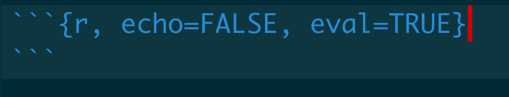

<style>
slides > slide {
  overflow-x: auto !important;
  overflow-y: auto !important;
}
</style>


```{r setup, include=FALSE}
library(knitr)
library(tidyverse)
```

## Before we get to Rmarkdown, what is markdown?

- markdown is mini-language designed for designing documents. It allows users to have the functionality of a word processor - different fonts, bullet points, tables, etc - but written completely in plain text 

- markdown has been used for years(since the early 90s), but because of its steep learning curve many choose to avoid it 

## Rmarkdown

- Rmarkdown is a flavor of markdown repurposed by Rstudio. Rmarkdown was designed for programming notebooks, an environment where you can execute code *and* write in plain text. The R notebooks we've been using all use markdown.
- R notebooks can be "knit" into reports. These reports are highly customizeable with a huge number of output formats, including word documents and powerpoint presentations 
- markdown can be used for blogs/websites, conference posters, and scientific publications  
- the slides we have been using for class have all been made through R Markdown 

## Benefits of Rmarkdown

- document your code much easier, as its easier to write comments and longer explanations in plain text 
- create a report/presentation that is descriptive as well as dynamic; a new version of the report can be generated with out having to remake figures and move them around
- templated reports - if you commonly run an analysis, set up an Rmarkdown notebook such that all you need is input data and the same figures/tables will be generated.
- reproducibility: you know exactly what code you used to make a specific plot.
- Rmarkdown is probably one of the best and most useful features of the R programming language

## layout of a notebook cell

- We've briefly covered how to use R notebooks, but we'll go into more detail now about how it all works 
```{r fig.height=2, echo=FALSE}

```

- within the curly brackets for each cell, we set parameters on how the *output* should look like. In this case we set `echo=FALSE` which means we don't want the the code cell to be printed, and `eval=TRUE` mean, run this chunk of code. 
- These parameters only affect the cell in which they are set.
- as you may have noticed from the exercise notebooks, cells can be named, by adding a title right after the `r` part of the cell header

## layout of a notebook cell

- to globally change settings for all chunks, you must have a chunk names `setup` as the first chunk of the notebook 

- a complete list of options is available [here](https://rstudio.com/wp-content/uploads/2015/03/rmarkdown-reference.pdf)


## changing parameters for all cells
- to globally change a setting in rmarkdown, make a cell at the beginning of your document named setup 
- within this chunk set options by using the `opts_...`  functions from the `knitr` library
```{r fig.height=2, echo=FALSE}
knitr::include_graphics('../src/setup_chunk_example.png')
```

- within this `setup` chunk, we can change the working directory for the notebook with the following command 
```
knitr::opts_knit$set(root.dir = 'some_path')
```

## the `knitr` library
- `knitr` is the package for the actual R code that converts R markdown into a rendered format. We generally don't need to use it beyond formatting notebook parameters. 

## changing non-cell parameters 
- We can use functions from `knitr` to control a wide range of output 

- for example, changing the root(working directory)
```{r  eval=FALSE}
#```{r setup}
library(knitr)
opts_knit$set(root.dir = '/Users/swamyvs/personal/')
#```
```

## changing parameters globally
- we can use a similar syntax as before to globally change parameters for all chunks 
```{r  eval=FALSE}
#```{r setup}
library(knitr)
opts_chunk$set(echo = F)
#```
```

## RMarkdown in the context of plotting

- Rmarkdown is crucial for plotting;
- when making plots in RMarkdown, each cell defines the plotting environment for making a plot, in terms of the physical space a plot can take up (the units are in inches)

```{r, fig.height=1, fig.width=1}
#```{r, fig.height=1, fig.width=1}
#```
ggplot(mtcars) +
  geom_point(aes(mpg, disp)) + 
  ggtitle('Plot 1')
```

## RMarkdown in the context of plotting

```{r, fig.height=3, fig.width=3}
#```{r, fig.height=3, fig.width=3}
#```
ggplot(mtcars) + 
  geom_point(aes(mpg, disp)) + 
  ggtitle('Plot 1')
```


## using external images
- you can link directly to an image via its path relative to the notebook, using the following syntax: ``

- examples ``


## using external images
- images can also be used through a notebook chunk with the `include_graphics` function from `knitr`
```{r}
knitr::include_graphics('../src/complex_heatmap_example.png')
```
- this is useful for when you want to take advantage of some of the chunk formatting options offered by `knitr`

## rendering tables 
-  the `knitr` package provides the `kable` function to embed nice looking tables 
```{r}
kable(iris[1:5, ])
```

## rendering tables 
- there are many other functions from libraries for making tables. A particularly useful one is `DT`, which creates an interactive table 
```{r}
DT::datatable(mpg)
```

## other useful features
- automatic citation management: refer to each reference as a tag that gets automatically formatted when the document is generated
- Rmarkdown
`a comprehensive annotation of mRNA transcripts across the human body [-@gtex_consortium_genetic_2017]`
- text output
`a comprehensive annotation of mRNA transcripts across the human body (13)`
- ordering is automatically generated, and formatting can be set at the beginning of each document to match specific styles, IE like that specified by a journal

## other useful features
- add inline code to text - dynamically generate numbers in a report
- Rmarkdown
```{r, eval=FALSE}
we found `r toString(NUMBER_OF_GENES)` differentially expressed genes
```
- text output
```
we found 2000 differentially expressed genes
```

## output formats
- out of the box, Rmarkdown converts documents to `html` format, like these slides. With a few extra packages, they can be converted to `pdf` or `docx`. 
- the same document can be converted to multiple output formats, which are set in the `yaml` header of the document
```{r eval = F}
---
title: "Intro to RMarkdown"
author: "Vinay Swamy"
date: "9/23/2020"
output: ioslides_presentation
---
```

-  this is the output format I used for the slides for this course


## output formats

```
---
title: "Intro to RMarkdown"
author: "Vinay Swamy"
date: "9/23/2020"
output: pdf_document
___
```

## extensions to Rmarkdown
- Other developers have created packages to create different types of media using Rmarkdown as the formatting language. 
- `blogdown` is a popular package for making websites, where the page layout can be specified in Rmarkdown
- `posterdown` is a package for making scientific posters using Rmarkdown. We'll be covering and using this package today.

## using `posterdown`
-  poster down is remarkably easy to use. install the package and set the output in the document header as `output: posterdown::posterdown_html`.
- a few other settings can be tweaked in the yaml like including a logo or setting the number of columns


