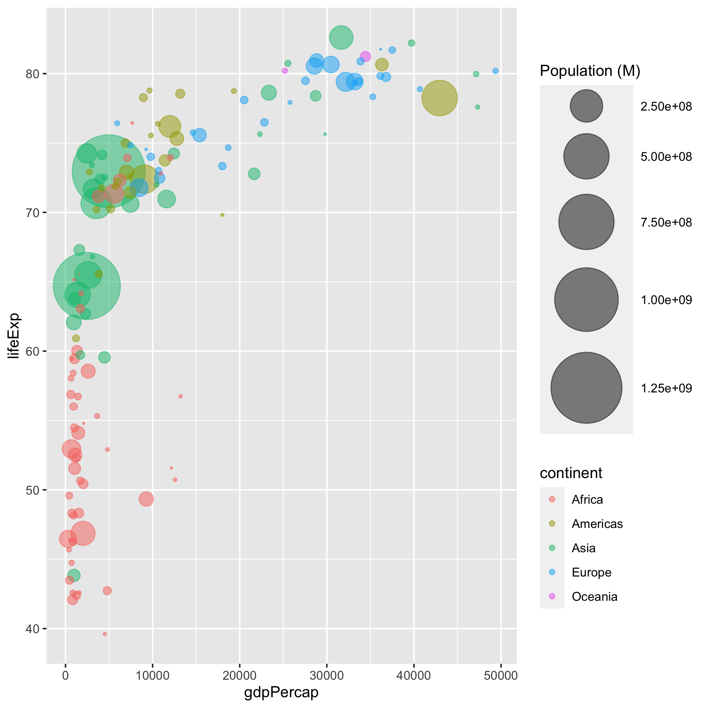

## Practice with themes 

We're going to work with one of the plots we made earlier 


```{r}
library(ggplot2)
ggplot(iris) + 
    geom_point(aes(x=Sepal.Length, y=Sepal.Width, color = Species)) + 
    ggtitle(' Width vs Length for Iris Sepals') + 
    xlab('Sepal Length')+
    theme(plot.title = element_text(size = 12, family = 'Palatino'))
```


```{r}
ggplot(mpg) + 
  geom_bar(aes(x=manufacturer, fill = class)) 

```

Assign descriptive axis labels and a plot title to the plot
```
ggplot(iris) + 
    geom_point(aes(x=Sepal.Length, y=Sepal.Width, color = Species)) + 
    ggtitle(' ') + 
    xlab('')+
    theme(plot.title = element_text(size = 12, family = 'Palatino'))
```

```{r}
ggplot(mpg) + 
    geom_bar(aes(x=manufacturer, fill = class))  + 
    xlab('Car Manufacturer') + 
    ylab('Number of Cars') +
    ggtitle('Class of car manufactured by Company')
```


```{r}
ggplot(iris) + 
    geom_point(aes(x=Sepal.Length, y=Sepal.Width, color = Species)) + 
    ggtitle(' ') + 
    xlab('')+
    theme( axis.text.x = element_text( angle = 90, hjust = -1))
```

fix the labels similar to how it was done in the example

```{r}
ggplot(mpg) + 
    geom_bar(aes(x=manufacturer, fill = class))  + 
    xlab('Car Manufacturer') + 
    ylab('Number of Cars') +
    ggtitle('Class of car manufactured by Company') + 
    theme( axis.text.x = element_text( angle = 45, hjust = 1), 
           axis.title.y =element_text(angle = 0, vjust = .5))
    

```


change the y axis title so it is parallel to the x axis title 

```{r}
ggplot(mpg) + 
    geom_bar(aes(x=manufacturer, fill = class))  + 
    xlab('Car Manufacturer') + 
    ylab('Number of Cars') +
    ggtitle('Class of car manufactured by Company') + 
    theme( axis.text = element_text( angle = 45, hjust = 1))
```

change the font of the title to AvantGarde, the color to red

```{r}

ggplot(mpg) + 
    geom_bar(aes(x=manufacturer, fill = class))  + 
    xlab('Car Manufacturer') + 
    ylab('Number of Cars') +
    ggtitle('Class of car manufactured by Company') + 
    theme( plot.title = element_text(family = 'Palatino', 
                                     color = 'red'))

```


```{r}

```


now use guide to reposition the legend to the top of the plot 
```{r}
ggplot(iris) + 
    geom_point(aes(x=Sepal.Length, y=Sepal.Width, color = Species)) + 
    ggtitle(' ') + 
    xlab('')+ 
    guides(color = guide_legend(title.position = 'bottom' ))


```

```{r}

ggplot(mpg) + 
    geom_bar(aes(x=manufacturer, fill = class))  + 
    xlab('Car Manufacturer') + 
    ylab('Number of Cars') +
    ggtitle('Class of car manufactured by Company') + 
    theme( plot.title = element_text(family = 'Palatino', 
                                        color = 'red')) + 
    guides(fill = guide_legend(title = 'Type of car',  title.position = 'bottom' ))

```


## practice with colors
- We'll be working with the `storms` data set in dplyr library(we havent covered this yet, but we will) for this part 

```{r}
library(dplyr)
data("storms")
storms
```

make a violin plot for `pressure`, using `status` as the x variable. Give axes appropriate titles. 

```{r}

ggplot(storms) + 
    geom_violin(aes(x=status, y=pressure, fill = status))

```

explore the palettes in the `pals` package. I've written a function to let you plot color palletes 
```{r}
install.packages('pals')
install.packages('patchwork')
```


```{r}
library(pals)
library(patchwork)
library(ggplot2)
library(tibble)
source('../src/plot_pal.R')
plot_pal(pals::plasma(100))

```

pick a palette and use the appriate `scale_..._discrete` function to color your plot based on the `status` column

```{r}

color_palette = pals::alphabet()
names(pals) <- NULL
ggplot(storms) + 
    geom_violin(aes(x=status, y=pressure, fill = status))+
    scale_fill_discrete(type = pals[c(3, 6, 8)])
color_palette
```


```{r}
unique(storms$status)
storms_color_mapping <- c( 
                   "tropical depression" = "#94FFB5"  ,  
                   "tropical storm" = "740AFF"  ,   
                   "hurricane"  = "#426600")
storms_color_mapping 
```

now pick colors from different palettes, and use them as part of a `scale_...manual`. 

```{r}

iris_color_mapping <- storms_color_mapping
names(iris_color_mapping) <- as.character(unique(iris$Species))
ggplot(iris) + 
    geom_boxplot(aes(x=Species, y= Sepal.Length, fill = Species))+ 
    scale_fill_manual(values = iris_color_mapping)
guides(y= guide_axis(...))
```


```{r}

ggplot(storms) + 
    geom_violin(aes(x=status, y=pressure, fill = status)) + 
    scale_fill_manual(values = storms_color_mapping)

```


make a scatter plot of `wind` vs `pressure`, using the `category` to color the points using a contionus scale. make sure `category` is a continous variable
```{r}

```

## customizing multiple aesthetics 

- the `gapminder` dataset is a popular example dataset about the life expectancy, GDP and population for differnt countries across the world 



```{r}
library(ggplot2)
ggplot(iris) + 
    geom_point(aes(x=Sepal.Length, 
                   y= Sepal.Width, 
                   size = Petal.Length, 
                   color = Species),
               alpha = .25
               )

```


- this is a bubble plot. We're going to remake this plot with ggplot.
- gdpPercap as the x axis 
- lifeExp as the y axis
- pop as the point size
- continent as the color
- alpha changed globally


```{r}
ggplot(data) + 
    geom_point( aes( x=  gdpPercap, 
                     y= lifeExp,
                     size = pop, 
                     color = continent),
                alpha = .4
                ) +
    ylab('Life Expetancy') + 
    ggtitle('Population Demographics across the World') + 
    theme_bw()
```


```{r, fig.height=4}
library(readr)
data <- read_tsv('../src/gapminder_2007.tsv.gz')
```

```{r}

```


```{r}
install.packages('readr')
library('readr')
```

```{r}
zz=gzfile('../src/gapminder_2007.tsv.gz','rt')   
data=read.table(zz,sep = '\t',header = T, stringsAsFactors = F)
```


