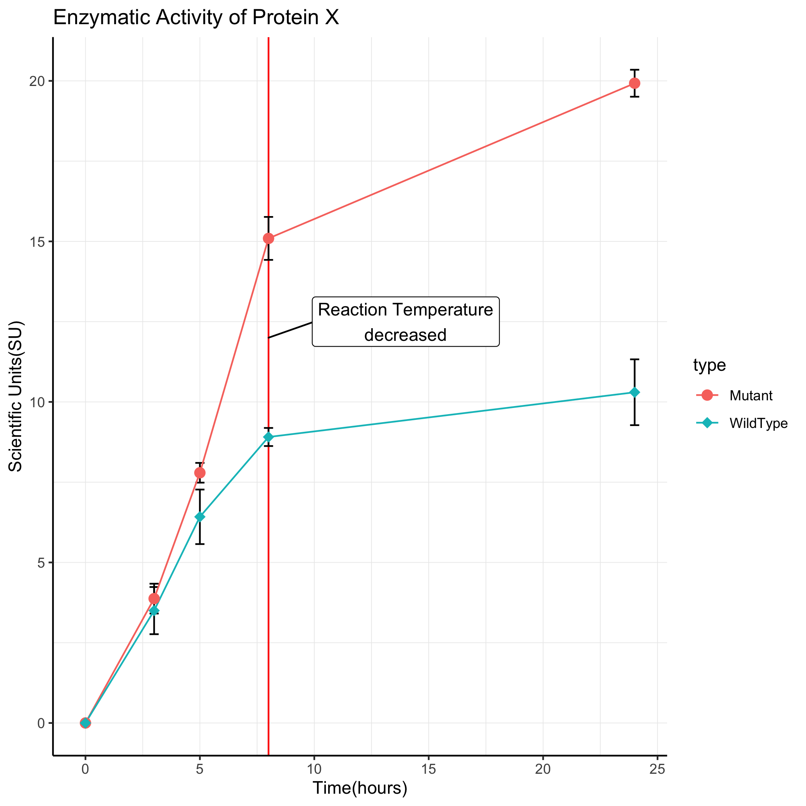

install the ggpattern package 

```{r}
install.packages('remotes')
remotes::install_github("coolbutuseless/ggpattern")
```

## gapminder and ggpattern

```{r}

library(ggpattern)
gapminder_ss <- read_tsv('../src/gapminder_2007.tsv.gz')
gapminder_bygender <- gapminder_ss %>% 
     mutate(gender = sample(c('male', 'female'), nrow(gapminder_ss), replace = T))
ggplot(gapminder_bygender) + 
  geom_bar_pattern(aes(x= continent, pattern = gender, fill = continent), position = 'dodge')
```

- I've added some data about gender to the `gapminder` dataset. use this data set to calculate the average lifespan per continent per gender. plot a bargraph with colors for each continents and patterns for each gender. 
- hint: becasue the data is averaged, you will be using `geom_col`

```{r}
gapminder_summarized <- gapminder_bygender %>% 
    group_by(continent, gender) %>% 
    summarise(avg_lifespan = mean(lifeExp))
ggplot(gapminder_summarized) + 
    geom_col(aes(x=continent, y= avg_lifespan, fill = continent) )
?geom_rect
```


```{r}
df <- data.frame(
  x = rep(c(2, 5, 7, 9, 12), 2),
  y = rep(c(1, 2), each = 5),
  z = factor(rep(1:5, each = 2)),
  w = rep(diff(c(0, 4, 6, 8, 10, 14)), 2)
)
ggplot(df, aes(x, y)) +
  geom_tile(aes(fill = z), colour = "grey50")
ggplot(df, aes(x, y, width = w)) +
  geom_tile(aes(fill = z), colour = "grey50")
ggplot(df, aes(xmin = x - w / 2, xmax = x + w / 2, ymin = y, ymax = y + 1)) +
  geom_rect(aes(fill = z), colour = "grey50")

ggplot(iris) + 
  geom_histogram(aes(x=Sepal.Length), bins = 100)
```


## revisting the line graph from earlier with `ggpubr`



```{r}

```


Remember this plot?
use `ggpubr::ggline` to remake the line graph we made a few exercises ago

```{r}
install.packages('ggpubr')
```

```{r}

library(ggpubr)
data <- read_tsv('../src/Reporter_assay_results.tsv.gz')
data_long <- data %>% 
    pivot_longer(c(-Time, -Replicate), names_to = 'condition', values_to = 'obs')

ggline(data=data_long, x="Time", y="obs", group = "condition", add='mean_se', shape = 'condition', color ='condition')

```


```{r}
getwd()

```

filter the data to the last time point, and make a boxplot with `ggboxplot`. Include a test for a statstically significant change in the data on the plot. 
```{r}
data_last_tp <-  data_long %>% filter(Time == 24)
ggboxplot(data = data_last_tp, x="condition", y= "obs", fill = 'condition') 
    ?stat_compare_means

```


## gganimate

- continuing with the gapminder dataset, remake the bubble plot we made yesterday. We'll be using the full dataset this time, and have data for many years. Create an animated version of the bubble plots we made earlier to visualize changes across time. 
- customize the plots with some themes and palettes from 

```{r}
install.packages('gapminder') # this installs the gapminder dataset into R
install.packages('gganimate', type = 'source')
install.packages('ggsci')
```


```{r}
library(gapminder)
library(ggplot2)
library(gganimate)
library(ggsci)
View(gapminder)
p <- ggplot() + 
    geom_point(data= gapminder, aes(x= gdpPercap, y=lifeExp, 
                             color = continent, size = pop), alpha = .5) +
    guides(size = guide_legend(title = 'Population (M)'))+ 
    scale_color_aaas() + 
    transition_time(year)
anim_save('animation.gif',animation = p )

```


## plotting with maps 

Lets make a plot with some real data. We're gonna be working with some data about COVID-19 testing in maryland. 
'../src/MD_COVID_cases_by_zip.tsv.gz' contains the per day number of positive covid cases by zip code for about 160 days in the state of maryland. 
'../src/maryland_zipcode_to_county.tsv.gz' contains a mapping for maryland zip code to counties
'../src/maryland_counties.shp' is a shapefile for counties in maryland (`st_read`)

```{r}

md_covid_cases <- read_tsv('../src/MD_COVID_cases_by_zip.tsv.gz')
md_county_to_zip <- read_tsv('../src/maryland_zipcode_to_county.tsv.gz')

download.file('https://opendata.arcgis.com/datasets/4c172f80b626490ea2cff7b699febedb_1.zip?outSR=%7B%22latestWkid%22%3A3857%2C%22wkid%22%3A102100%7D', 'maryland.zip')
unzip('maryland.zip')
md_shape <- read_sf("Maryland_Physical_Boundaries_-_County_Boundaries_(Generalized).shp")
```

Were going to take this data and make this:
As a starting point, this is the generaly workflow. 

Load data > join county level data to zip level data > aggreagte data to the county level  >  join map data
- first add the county information to the covid data. check how many counties are shared between the covid data and the map data 
- your should end up with a plot that colors each map region based on the the number of covid cases


```{r}

md_covid_cases <- read_tsv('../src/MD_COVID_cases_by_zip.tsv.gz')
md_county_to_zip <- read_tsv('../src/maryland_zipcode_to_county.tsv.gz')

colnames(md_county_to_zip) <- c('ZIP_CODE', 'county')

md_zip_covid_cases <- inner_join(md_county_to_zip, md_covid_cases) %>% 
    pivot_longer(c(-ZIP_CODE,-county, -OBJECTID), names_to = 'date', values_to = 'cases') %>% 
    mutate(cases = replace(cases, is.na(cases), 0))


md_covid_zip_geom <-  md_shape %>% select(county, geometry) %>%
    mutate(county = tolower(county)) %>% 
    inner_join(md_zip_covid_cases)
data_to_plot <-  md_covid_zip_geom %>% filter(date == '4_14_2020')

ggplot(data_to_plot)+
    geom_sf(aes(geometry=  geometry, fill = cases)) + 
    theme_void()

```


