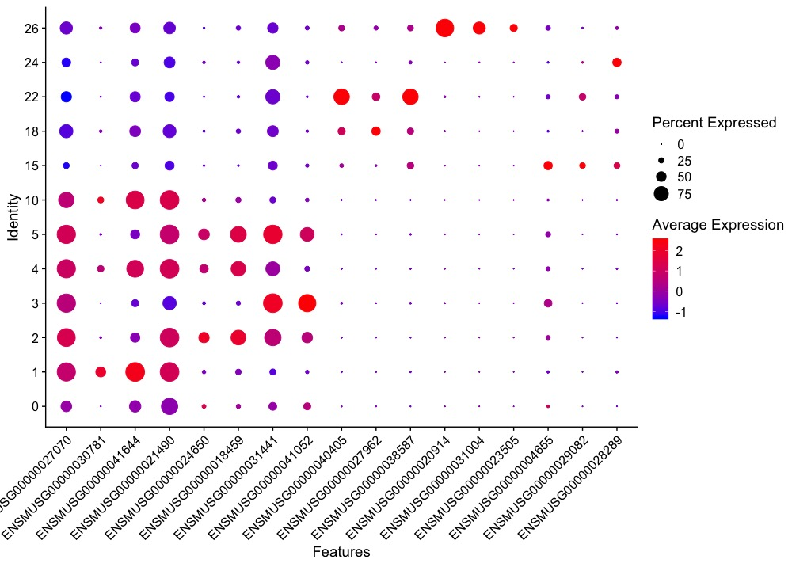

## We've covered a lot of visualiztion tools
- We extensively covered multiple visualization packages, with most of them centered around the `ggplot` API
- What I want to do now is help you build the your intuition about how to tackle recreating plots generated outside of ggplot or R. 


## Decontructing a plot
- When you see a  new visualization that you want to try and recreate,  here are some general strategies
- break the plot into separate pieces
  - What is the underlying data, what information does it contain, and how is it likely formatted; were any transformations applied to the before plotting?
  - what `geoms` will you need to recreate the plot. Are they all in `ggplot` or will you have to find an external package to draw a unique type of plot
  - What are the aesethetic properties - color scheme, point size, pattern etc (looking at legends helps for this  )
  - What are the graphical parameters - X/y axis labels/gridlines, legend orientation
 
## Example -  Dot plot 
- the X axis labels are Gene ID, and the Y axis labels are cell type IDs
```{r}

```

## lets recreate this dotplot
 
 
## Another example - recreating heatmaps in ggplot
- I don't want to beat a dead horse here with heatmaps


```{r, fig.height=8, fig.width=8}
library(ggtree)
library(patchwork)
gen_exp <- readRDS('../src/gene_expression_ss.RDS')
gene_cluster <- hclust(dist(gen_exp), method = 'Euclidian')
sample_cluster <- hclust(dist(gen_exp %>% t()))

gene_exp_long <- gen_exp %>% rownames_to_column('gene_name') %>% 
    pivot_longer(-gene_name, names_to = 'sample_name', values_to = 'count') %>% 
    mutate(gene_name = factor(gene_name, levels = rownames(gen_exp)[ gene_cluster$order]), 
           sample_name = factor(sample_name, levels = colnames(gen_exp)[sample_cluster$order]), 
           count = log2(count+1) ) %>% 
    arrange((gene_name), desc(sample_name))
row_dend <- ggtree(as.dendrogram(gene_cluster))
col_dend <- ggtree(as.dendrogram(sample_cluster)) + layout_dendrogram()

hm <- ggplot(gene_exp_long) + 
    geom_raster(aes(y=gene_name, x= sample_name, fill = count)) + 
    guides(y= guide_axis(position = 'right')) + 
    theme(axis.text.x = element_text(angle = 90))

design <-'
#C
BA'
hm + row_dend + col_dend   +plot_layout(design = design)
```

```{r}
library(ComplexHeatmap)
Heatmap(log2(gen_exp + 1), )
```

