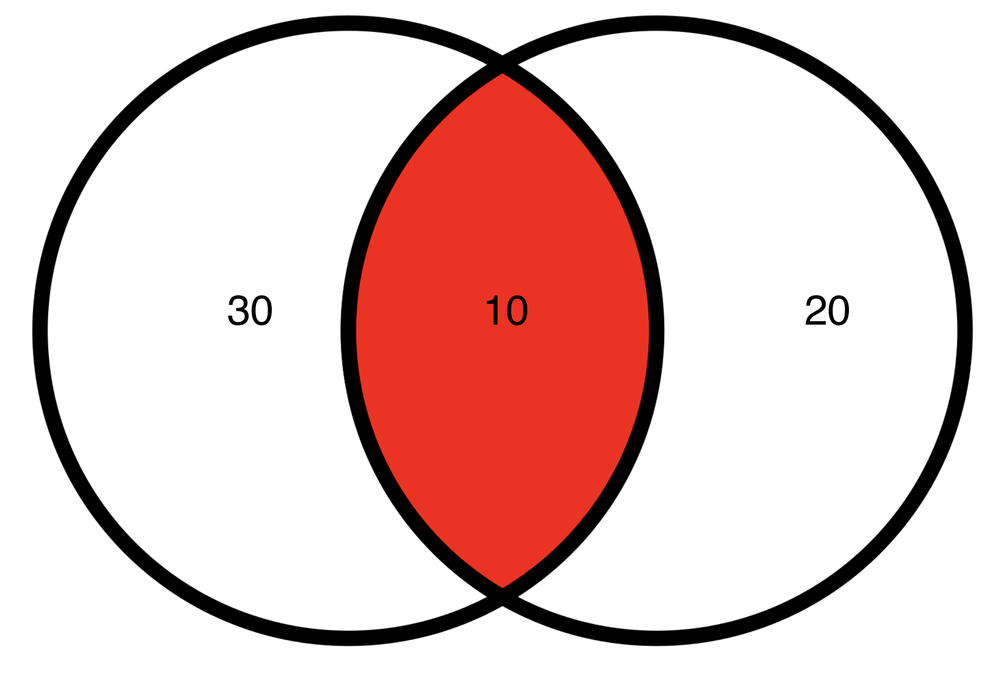
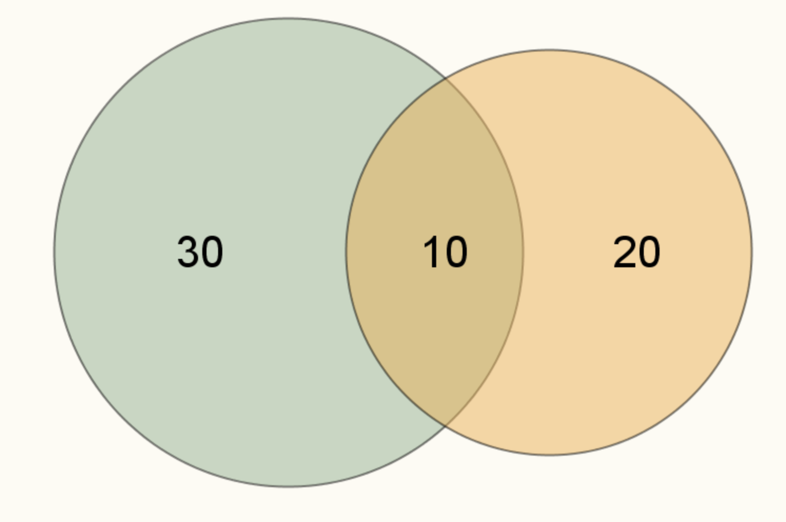
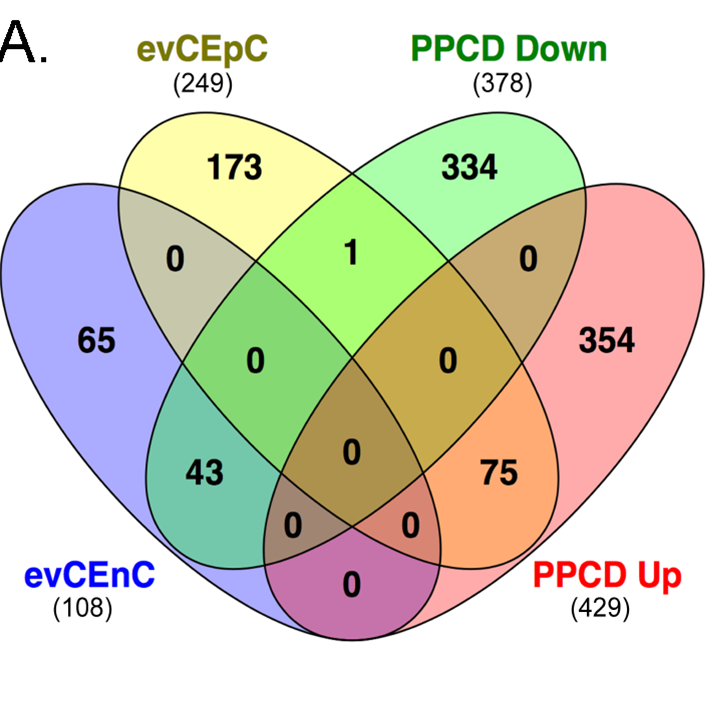
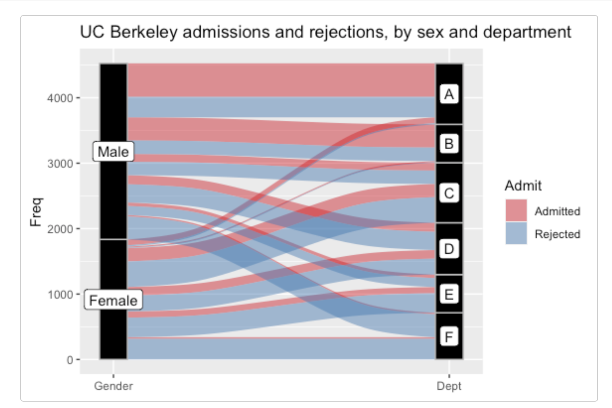

```{r, include=F}
library(tidyverse)
```

## Some visualizations are better than others

- Plots are designed to accruate convey relationships within data. Different kinds of plots are good at conveying different kinds of relationships. A mistake most people make is not understanding specifically what a plot is useful for. 

- For example take the venn diagram 


- The venn diagram is designed to show the intersection between two sets, with the numbers repsenting the total in each different part of the set intersections. In this venn diagram text is the most onformative part of the plot. 
- Good plots don't need text *inside the plot* to communicate the relationship they describe (not talking about legends, titles,etc). if a plot does have text, the plot should visually match the text 


-  this venn diagram has been drawn proportionally(ish) so that the area matches the size of the set. Even without the text, the relationship between the data is clear.

## When not to use venn diagrams 
- because simple venn diagrams are easy to interpret, the often get used for more complicated set interactions 

- This is an example of a bad venn diagram. Not only do the numbers not match the set sizes, it is difficult to easily see some of the more complicated set intersections.

## Upset Plots
- A *far* superior way to showing set intersections is an Upset plot 


- the stick-and-ball plot at the bottom  represents the intersection between the sets. The bar plot at the top represents the size of the intersection. The bar plot to the left represents the size of the whole sets
- Its much easier to pick out individual set intersections, ans compare sizes across multiple intersections

- the `ComplexUpset` is my favorite package for plotting Upset plots. It uses `ggplot` under the hood, and provides a lot more flexibility compared to other packages
```{r, include=F}
example_data <- tibble(id = sample(as.character(1:100) ,500, replace = T ), 
                       color = sample(c('red', 'blue', 'yellow'), 500,replace = T ) ) %>% 
  arrange( id) %>% distinct
example_data_wide <- example_data %>% mutate(val = T) %>% 
  pivot_wider(names_from =color, values_from  = val)
example_data_wide[is.na(example_data_wide)] <- F

```

## The `ComplexUpset` package
- the package requries you to have data formatted in a certain way. We've been working with tidy data, wherea single observation is repeated, but each observation-attribute is distinct
```{r}
example_data
```

## The `ComplexUpset` package
- `ComplexUpset` requires data to be in wide format, with a column for whether or not an observation has a particular attribute, and so one attribute for each column
```{r}
library(ggalluvial)

Titanic %>% as_tibble() 
```

```{r}
example_data_wide
```

## The `ComplexUpset` package
- once we have the data formatted, plotting is fairly simple
```{r}
cols_to_intersect <- c('red', 'yellow', 'blue')
upset(data = example_data_wide, intersect = cols_to_intersect)
```
- theres a lot more we can do with `complexUpset`; read through the documentation [here](https://krassowski.github.io/complex-upset/articles/Examples_R.html) to learn more 

## lets do some examples 

## Visualizing changes in set intersection 

- A nice way to visualize *changes* in categorical data are alluvial  plots. It's a bit of a niche plot, but can be very useful if used properly.


- These are also known as sankey or waterfall plots.

## alluvial plots with `ggalluvial`
- the package lets make alluvial plots using ggplot synatx
- like `complexUpset`, `ggalluvial` requries data in wide format

```{r}
titanic_wide <- as_tibble(Titanic) %>% 
  mutate(passenger_ID = 1:nrow(.)) %>% select(passenger_ID,Freq=n, everything())
titanic_wide
```

## alluvial plots with `ggalluvial`
- to create the plot, three `geoms` are required: `geom_alluvial`(draws the ribbons), `geom_stratum`(draws the columns),`geom_text`(for the column text)

```{r}
library(ggalluvial)
ggplot(data = titanic_wide,
       aes(axis1 = Class, axis2 = Sex,
           y = Freq)) +
  geom_alluvium(fill = 'blue') +
  geom_stratum() +
  geom_text(stat = "stratum", aes(label = after_stat(stratum))) +
  theme_minimal() 
```

- both `geom_alluviium` and `geom_stratum` require same `aes` parameters. `aes(axis1 = Class, axis2 = Sex,y = Freq)`. Any number of axes can be defined, but at least 2 are required

## Comparing continous data
- There are multiple well established for comparing continuous data, like boxplots or violing plots.

```{r}
library(ggridges)

ggplot(lincoln_weather,aes(y = `Mean Temperature [F]`, x = Month  )) + 
    geom_violin() +
    geom_boxplot(width=.1) + 
    theme_bw()
```

- while its definitely clear that each distribution is different, the plot itself is a little plain. Further more, if we were to expand this to many more variables, it would be diffcult to compare the population as a whole 

## Ridge plots
- Ridge plots are an alternative way to compare a large(ish) number of continuous distributions, especially where each variable represents a shift in time 

```{r}
ggplot(lincoln_weather, aes(x = `Mean Temperature [F]`, y = Month, fill = stat(x))) +
  geom_density_ridges_gradient(scale = 3, rel_min_height = 0.01) +
  scale_fill_viridis_c(name = "Temp. [F]", option = "C") +
  labs(title = 'Temperatures in Lincoln NE in 2016')
```
- While definitely not applicable for every type of continuous comparison, it is an aesthetically pleasing plot.
## Ridge plots through `ggridges`
- Ridge plots are easy to make with the `ggridges` package, which provides drop-in replacements for geom_violin

```{r, inlcude=F}
library(dplyr)
library(ggpubr)
library(ggrepel)
df <- bind_rows(  
  tibble(label = 'wildtype', count = rnorm(1000,mean= 0, sd= 1)),
  tibble(label = 'mutant', count = c(rnorm(100,mean = 0, sd= 1 ),rnorm(10,mean =5, sd= 1 )))
  ) %>% filter(count > 0) %>% mutate(label = factor(label, levels = c('wildtype', 'mutant')))
k <-table(df$label)

labdf <- tibble(label = names(k),n=k ) %>%  left_join( df %>% group_by(label) %>% summarise(h=max(count)))

plot_labeld <- ggplot() + 
  geom_violin(data=df, aes(x=label, y=count, fill=label)) +
  geom_label_repel(data= labdf, aes(x=label, y=h, label = n), nudge_x = -.05, nudge_y =.5) +
  ylab('Normalized Expression')+
  cowplot::theme_cowplot() + 
  theme(legend.position = 'top', legend.justification = 'center')

plot_sigif <- ggviolin(df, x='label', y='count', fill = 'label', ylab = 'Normalized Expression') + 
  stat_compare_means(label = 'p.signif')
```
## Violin plots - the size problem.
- one of the draw backs of violin and boxplots is that the number of observations used for the plot can't be seen by the data
- Hypothetical scenario: a lab compares gene expression between a wildtype model and mutant, and claims that the mutant is more active compared to the wildtype
```{r}
plot_sigif
```

## Violin plots - the size problem.
- However, what they dont show is that the sampe sizes for these plots are pretty different
```{r}
plot_labeld
```

## Violin plots - the size problem.
- Any journal will always ask you to provide the sample size, but its often in the text and separate form the figure. 
- And so the figure, without the use of labels with in the plot or text, convey an inaccurate picture of the data.

## scattered violin plots 
- one solution to this is to overlay points for each expression value onto the plot
```{r}
ggplot(data=df, aes(x=label, y=count, fill=label)) + 
  geom_violin( aes(x=label, y=count, fill=label)) +
  geom_jitter( aes(x=label, y=count ), width = .05)+
  ylab('Normalized Expression')+
  cowplot::theme_cowplot() + 
  theme(legend.position = 'top', legend.justification = 'center') 
```
## scattered violin plots 
- these plots use `geom_jitter` within `ggplot`, which lets plot points in a stack
- While these work, they don't look super nice

## the raincloud plot
```{r}
ggplot(df, aes(x = label, y = count, fill = label, color = label)) +
  geom_half_violin(side = 'r') + 
  geom_half_point(range_scale=.5, side = 'l', alpha = .3, shape=16) + 
  ylab('Normalized Expression')+
  cowplot::theme_cowplot() + 
  coord_flip()
```
- plotting half `geoms` is available through the `gghalves` package, which provides drop in replacements for several common geoms. 


